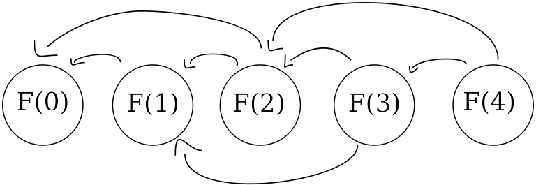

# The Plan

## Wprowadzenie

Czego szukamy?

* Rozwiązania problemów o wielu możliwych rozwiązaniach, z których chcemy wybrać optymalne
  * Genetyka - najdłuższy wspólny podciąg
  * Logistyka - problem komiwojażera
* Kombinatoryka
* Teoria gier - szukanie strategii wygrywającej

Jakie są problemy?

* Możliwych kombinacji może być bardzo dużo
* Trudno wygenerować możliwe rozwiązania
* Nie ma dobrego sposobu na opisanie problemu bądź sensowną implementację

Z czego skorzystamy:

* Obserwacja: Problemy często się powtarzają i się pokrywają
* Rozwiązanie problemu zależy od tego jak rozwiązaliśmy *podproblemy*

## Przykład problemu - Zadanie Podciąg Jasia

Mamy ciąg liczb $a = (a_1, a_2, ..., a_n)$. Chcemy wybrać taki podciąg złożony z $a_{i_1}, a_{i_2}, ..., a_{i_k}$, z następującym ograniczeniem: w podciągu nie mogą występować sąsiednie elementy:
$$
i_1 + 1 < i_2 \\
i_2 + 1 < i_3 \\
...
$$
Należy podać maksymalną sumę podciągu.

- Przykład: **10** 1 1 **10**. Rozwiązanie to 20.
- Inny przykład: -2 **2** -1 3 **5**. Rozwiązanie to 7.

Co robić?
* Proste rozwiązanie: sprawdzić wszystkie podciągi $O(2^n)$
* O wiele lepsze: **Programowanie dynamiczne**

### Rozwiązanie przykładu

Przypuśćmy teraz, że znamy już rozwiązanie dla każdego prefiksu $a$ poza całym ciągiem $a$.

Wprowadźmy oznaczenie, że $\mathcal{F}(p)$ oznacza rozwiązanie (czyli maksymalną sumę) dla ciągu $a_1, a_2, ..., a_p$.
W szczególności znamy wartości $\mathcal{F}(1), \mathcal{F}(2), ..., \mathcal{F}(n - 1)$.

Jak może wyglądać $\mathcal{F}(n)$? Są dwie możliwości: może albo zawierać $a_n$, albo go nie zawierać.
1. Jeżeli zawiera, to dodajemy do wyniku $a_n$ i odrzucamy $a_{n-1}$. Reszta rozwiązania może się składać z dowolnych pozostałych $n - 2$ elementów. Tak się składa, że znamy tę wartość - jest to $\mathcal{F}(n - 2)$. Otrzymujemy $\mathcal{F}(n - 2) + a_n$.
2. Jeżeli go nie zawiera, to przypadek jest prostszy: rozwiązanie składa się z pierwszych $n - 1$ elementów, czyli maksymalna suma jest równa $\mathcal{F}(n - 1)$.

Tym samym otrzymujemy wzór na $\mathcal{F}(n)$:
$$\mathcal{F}(n) = \texttt{max}(\mathcal{F}(n-1), \mathcal{F}(n-2) + a_n)$$

### Rozszerzenie

W ten sposób znaleźliśmy sposób na rozszerzenie rozwiązania z $a_1, a_2, ..., a_p$ do $a_1, a_2, ..., a_{p+1}$. Ponieważ wyniki zawsze są optymalne, możemy w ten sposób policzyć wszystkie wartości $\mathcal{F}$.

### Trochę terminologii, która się przyda

**Stan** to pewien podproblem, który wybraliśmy sobie do rozwiązania. W tym wypadku są to prefiksy $a$, ale nic nie szkodzi aby były to np. sufiksy. Stan przechowuje pewną wartość, tutaj jest to optymalna suma podciągu.

**Przejścia** to wzory które odwołują się do mniejszych podproblemów, które zawierają się w rozpatrywanym problemie. Chcemy w nich rozpatrzyć wszystkie możliwe sposoby, na jakie może powstać rozwiązania. Stany muszą być tak dobrane, aby istniały odpowiednie przejścia.

*Trudność*: wymyślić takie stany i przejścia, które rozpatrzą wszystkie możliwości i tym samym poprawnie znajdą wynik.

### Łańcuchy

Powiemy, że $A$ jest zależne od $B$ jeżeli można wybrać takie przejścia, że można dojść ze stanu $B$ do $A$ (przejście z $B$ do $A$ tzn. wartość $B$ pojawia się we wzorze na wartość $A$).

**Zależności** w dynamiku są o tyle ważne, że musi istnieć uporządkowanie topologiczne stanów: to znaczy takie, że nie ma dwóch takich stanów $A$ i $B$, że $A$ jest zależne od $B$ i $B$ występuje później w uporządkowaniu niż $A$.

Innymi słowy, nie może być cyklicznej zależności. (Nawiasem mówiąc, to znaczy że graf przejść i stanów jest acykliczny)

W tym przykładowym zadaniu graf zależności wygląda mniej więcej o tak:



### Implementacja

Na początek:
1) Trzeba pamiętać o przypadkach brzegowych. Zwykle wystarczy poszukać, kiedy wymyślone przez nas wzory nie działają. W tym wypadku jest tak dla $\mathcal{F}(1)$ i $\mathcal{F}(2)$, bo odwołują się do $\mathcal{F}(-1)$ i $\mathcal{F}(0)$. Nasze przypadki brzegowe można rozwiązać np. tak:
$$
\mathcal{F}(1) = \texttt{max}(0, a_1) \\
\mathcal{F}(2) = \texttt{max}(0, a_1, a_2)
$$
2) Należy znaleźć odpowiednie uporządkowanie na podstawie zależności, które mamy. Zwykle uporządkowanie będzie się narzucać (w zadaniu jest bardzo łatwo, wystarczy odwiedzać kolejno stany $\mathcal{F}(1), \mathcal{F}(2), ..., \mathcal{F}(n)$).

A teraz do praktyki:

#### Rekurencja
Najłatwiej jest podejść rekurencyjnie i bezpośrednio wykorzystać wzory. Nie musimy wtedy dbać o kolejność odwiedzanych stanów.
```python
def F(n):
    if n == 1:
        return max(0, A[1])
    else if n == 2:
        return max(0, A[1], A[2])
    else:
        return max(F(n - 1), F(n - 2) + A[n])
```
Niestety, w ten sposób rozwiązanie jest wykładnicze (jaka jest jego złożoność?). Wystarczy jednak lekko ulepszyć podejście.
#### Tabulacja
Zapiszemy kolejne wartości funkcji w tablicy i odwiedzimy i wypełnimy kolejne jej komórki w odpowiedniej kolejności.
```python
F[1] = max(0, A[1])
F[2] = max(0, A[1], A[2])
for i = 3, 4, ..., n:
    F[i] = max(F[i - 1], F[i - 2] + A[n])
```

#### Utrzymywanie tylko koniecznych stanów
Technika ta zmniejszy zużycie pamięci. Zauważmy, że $\mathcal{F}(n)$ potrzebne jest nam do policzenia jedynie $\mathcal{F}(n + 1)$ i $\mathcal{F}(n + 2)$. Możemy się go pozbyć po 2 iteracjach. W tym zadaniu możemy to jeszcze bardziej uprościć i trzymać 3 zmienne, które będą oznaczać obecne $\mathcal{F}(i - 2), \mathcal{F}(i - 1), \mathcal{F}(i)$.
```python
a = max(0, A[1])        # F(i - 2)
b = max(0, A[1], A[2])  # F(i - 1)
c = 0                   # F(i)
for i = 3, 4, ..., n:
    c = max(a, b + A[i])
    a = b
    b = c
```

Rozwiązania oczywiście zakładają $n \ge 2$ -- wystarczy dopisać obsługę przypadków brzegowych.

## Podsumowanie - schemat działania

1. Znajdź **podproblemy**. W jaki sposób można opisać wszystkie przypadki? Jak opisać je rekurencyjnie? (przypadek składa się z pewnego fragmentu plus mniejszych przypadków)
2. Wybierz **stany** i przechowywane przez nie wartości, oraz
3. Wybierz **przejścia**, tak, żeby było dobrze.
4. Dobierz **uporządkowanie**, kolejność odwiedzanych stanów.
5. Wypisz **przypadki krańcowe**, dla których nie działają wzory.
6. Zwróć **wynik** dla stanu, który opisuje cały problem.

Techniczne:
1. Podliczenie złożoności obliczeniowej, zarówno pamięciowej i czasowej
   - Jeżeli czasowa jest za duża, rozważ inne stany i przejścia bądź użyj odpowiedniej struktury danych, poszukaj, które stany są niepotrzebne, etc. (jest dużo sposobów)
   - Jeżeli pamięciowa jest za duża, sprawdź, czy da się utrzymywać mniej stanów w pamięci.
2. Wybranie sposobu implementacji:
   - Rekurencja (z odpowiednim usprawnieniem -- *memoizacja*).
   - Tabulacja
      * z góry na dół *(top-down)*: stany odwołują się niżej, prościej
      * z dołu na górę *(bottom-up)*: stany aktualizują stany zależne,
        czasami lepiej

## Klasyki

Rozważymy teraz kilka klasycznych problemów:
* problem plecakowy
* problem wydawania reszty
* najdłuższy wspólny podciąg

### Problem plecakowy (Knapsack problem)

Mamy $n$ przedmiotów opisanych wagami $w_i$ oraz wartościami $v_i$. Dany jest nam do dyspozycji plecak, który może pomieścić przedmioty o sumarycznej wadze $W$. Jaką maksymalną sumaryczną wartość przedmiotów możemy uzyskać?

1. **Podproblemy**: problem składa się z dwóch ważnych cech: pojemności plecaka i przedmiotów. Trzeba nadać jakąś kolejność przedmiotom.
2. **Stan**: Niech stanem będzie $K(w, p)$, gdzie $w$ to obecna waga przedmiotów w plecaku a $p$ to ilość rozpatrzonych przedmiotów. Wartość stanu to maksymalna wartość przedmiotów o wadze $w$.
3. **Przejścia**: Możemy wziąć $p$-ty przedmiot, albo tego nie zrobić. Mamy więc $K(w, p) = \texttt{max}(K(w - w_i, p - 1) + v_i, K(w, p - 1))$
*Strażnik* (sentinel): Możemy przyjąć że dla $w < 0$ jest $K(w, p) = -\infty$.
4. **Uporządkowanie**: Dosyć intuicyjne: rosnące wartości $w$, a tam rosnące wartości $p$, bądź na odwrót.
5. **Przypadki krańcowe**: Najlepiej dodać strażnika, że $K(w, 0) = 0$.
6. **Wynik**: $\texttt{max}_{w \le W}(K(w, n))$

Złożoność: $O(nW)$.

### Problem wydawania reszty

Mamy $n$ nominałów o wartościach $x_i$ i chcemy nimi wydać wartość $Y$. Nominałów można używać dowolnie wiele razy. Chcemy użyć minimalnej liczby nominałów.

1. **Podproblemy**: Liczy się dotychczas wydana kwota i rozpatrzone nominały.
2. **Stan**: $R(y, p)$ -- minimalna liczba nominałów spośród pierwszych $p$, aby otrzymać wartość $y$.
3. **Przejścia**: $R(y, p) = min(R(y - x_i, p) + 1, R(y, p - 1))$.
4. **Uporządkowanie**: Tak jak problem plecakowy.
5. **Przypadki krańcowe**: Tak jak problem plecakowy -- strażnik jest dobrym pomysłem.
6. **Wynik**: $R(Y, n)$.

Złożoność: $O(nY)$.

### Najdłuższy wspólny podciąg (Longest Common Subsequence)

> Przez **podciąg** ciągu $a = (a_1, a_2, ..., a_n)$ definiujemy taki ciąg $b = (b_1, b_2, ..., b_k)$, że istnieje taki ciąg indeksów $p_1 < p_2 < ... < p_k$, że dla każdego $1 \le i \le k$ zachodzi $b_i = a_{p_i}$.

Mając dane dwa ciągi, $a$ i $b$, znajdź długość jak najdłuższego ciągu $c$, że $c$ jest podciągiem $a$ oraz $b$ jednocześnie. $c$ o maksymalnej długości nazywany jest najdłuższym wspólnym podciągiem - LCS.

1. **Podproblemy**: Prefiksy obu ciągów.
2. **Stan**: $L(p, q)$ - długość LCS dla $a' = (a_1, a_2, ..., a_p)$ oraz $b' = (b_1, b_2, ..., b_q)$.
3. **Przejścia**: Dwa przypadki: albo $a_p$ i $b_q$ są w LCS, albo nie. Jeżeli tak, to dodajemy 1 do wyniku i skracamy oba prefiksy. W innym wypadku możemy przejść do dowolnej prefiksu.
   $L(p, q) = \texttt{max}(L(p-1, q-1)+1\texttt{ if }a_p=b_q,L(p-1,q),L(p,q-1))$
4. **Uporządkowanie**: $(1, 1), (1, 2), ..., (1, |b|), (2, 1), (2, 2), ...$
5. **Przypadki krańcowe**: Jeżeli jeden z ciągów jest pusty, to LCS jest pusty.
6. **Wynik**: $L(|a|, |b|)$

Złożoność: $O(|a| \cdot |b|)$

#### Odtwarzanie wyniku

A co jeżeli chcemy odtworzyć wynik? (W wypadku LCS: Jak odzyskać ciąg $c$?)

Przejścia symbolizują decyzje podejmowane przy budowie wyniku. Wystarczy więc przechowywać dodatkową tablicę, która utrzymuje optymalną decyzję. Remisy mogą być roztrzygane dowolnie (różne sposoby pozwalają na wygenerowanie wszystkich możliwych rozwiązań).

Przykładowo dla LCS: niech $\mathcal{B}$ symbolizuje wybór.
* $\mathcal{B}(p, q) = \texttt{TAKE}\text{, jeżeli optymalne jest } L(p-1,q-1)+1$
* $\mathcal{B}(p, q) = \texttt{CUT_A}\text{, jeżeli optymalne jest } L(p-1,q)$
* $\mathcal{B}(p, q) = \texttt{CUT_B}\text{, jeżeli optymalne jest } L(p,q-1)$

A w kodzie LCS wyglądać to będzie mniej więcej tak:

```python
p, q = n, m
c = []
while (p, q) != (0, 0):
    if B(p, q) == TAKE:
        c += a[p] # == b[q]
        p -= 1; q -= 1
    else if B(p, q) == CUT_A:
        p -= 1
    else if B(p, q) == CUT_B:
        q -= 1
c.reverse()
```

W ten sposób odtworzymy znaki od końca - gdy dojdziemy do stanu $(0, 0)$, kończymy działanie i odwracamy ciąg $c$.

Taka technika często nazywana jest *backtracking*, czyli podążanie za swoimi śladami.

Warto zauważyć, że gdy używamy backtrackingu problematyczne może być ograniczanie zużycia pamięci.

### Długość cyklu Collatza

Prosty (i mniej klasyczny) problem na którym można dobrze zobrazować działanie memoizacji to problem znalezienia długości ciągu Collatza.

Zaczynamy od pewnej liczby całkowitej $c_0$. Jeżeli jest parzysta, to $c_1 = \frac{c_0}{2}$. W przeciwnym wypadku $c_1 = 3c_0 + 1$. Postępujemy analogicznie z $(c_1, c_2, ...)$. Długość cyklu Collatza to najmniejsze $i$ dla którego $c_i = 1$. Nawiasem mówiąc, hipoteza Collatza mówi, że takie $i$ istnieje dla każdego $c_0$.

Oznaczmy długość ciągu Collatza dla $c_0 = n$ jako $C(n)$.

Powiedzmy że chcemy policzyć maksymalne $C(n)$ spośród liczb od $1$ do $k$.

Moglibyśmy dla każdej z nich iteracyjnie liczyć $C$, ale zamiast tego możemy skorzystać z następującego podejścia (memoizacji):

Zauważmy, że $C(1) = 0$ oraz $C(n) = C(n_1) + 1$ (gdzie $n_1$ to następna liczba w ciągu Collatza po $n$). Tak więc licząc pewne $C(n)$ możemy zapisywać jakie liczby już odwiedziliśmy i policzyliśmy dla nich $C$ - jeżeli potem do nich trafimy, możemy odczytać wartość i od razu ją zwrócić, zamiast liczyć ją ponownie.

```python
# lim to pewna eksperymentalnie wyznaczona wartość
#  - maksymalna wartość, jakiej równy będzie n
vis = array(lim, False)
memo = array(lim, 0)

def C(n):
    if n == 1:
        return 0
    else if vis[n]:
        return memo[n]
    else:
        vis[n] = True
        memo[n] = C(n // 2 if n % 2 == 0 else 3*n + 1) + 1
        return memo[n]
```

Najlepiej zamiast tablicy skorzystać ze struktury rodzaju mapy/słownika (np. `std::map` w C++) -- wtedy nie musimy przewidywać, ile pamięci potrzebujemy.

Memoizacja jest tutaj dobrym wyborem, bo trudno przewidzieć w jakiej kolejności należy przejść bo liczbach, aby uporządkowanie było poprawne -- ciąg Collatza jest bardzo chaotyczny, na zmianę rośnie i maleje.
